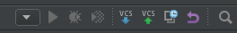
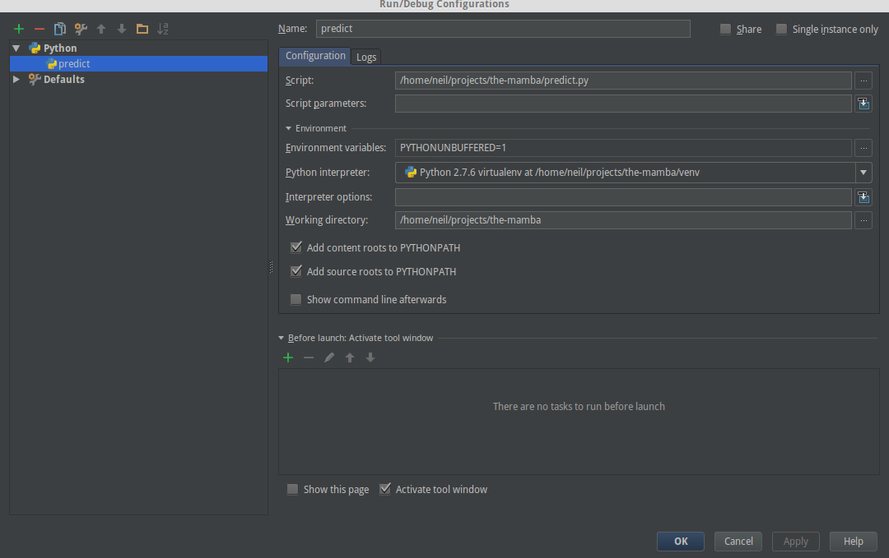

# the-mamba
Repository to hold tutorial for Mariko to learn machine learning and git commands.

- [Setup](#setup)
- [Git Command Flow](#git)
- [Python Environment Setup](#python)
- [IDE Setup](#ide)
- [Run](#run-project)

# Setup

- Download and install [git for windows](https://git-scm.com/download/win)
- Download and install [gui for github](https://desktop.github.com/)
- Clone the repository into a folder [clone link](https://github.com/sealneaward/the-mamba.git)

# Git

- Git is a subversion control tool that allows you to procedurally edit your code and store every change you make

### Overall Structure
Git works in a simple workflow

```
pull changes from repo -> add changed files -> create commit -> push to repository
```
You can read more [here](https://help.github.com/desktop/guides/getting-started/)

### Git From the Command Line (Linux)
- clone repositories

```
git clone https://github.com/sealneaward/the-mamba.git
```

- After files are changed, you can see the status of your repo and add them to the local changes

```
git status
git diff
q (if you cannot escape the git diff command)

git add --all
git commit -m "message goes here"

git push
```

# Python

### Windows

- If you are using windows, you need to follow these [steps](https://github.com/sealneaward/template-py#windows-setup) for installation (send me a pm if this happens)

### Linux

- Follow these steps
- More [documentation](http://docs.python-guide.org/en/latest/dev/virtualenvs/) on virutal environments

```
sudo pip install virtualenv virtualenvwrapper
virtualenv venv
source venv/bin/activate
sudo pip install -r requirements.txt
deactivate
```

# IDE Setup

### PyCharm
- sign up for a [student license](https://www.jetbrains.com/student/) from JetBrains
- download and install the professional version of [PyCharm](https://www.jetbrains.com/pycharm/download/#section=linux)
- extract the PyCharm folder (put it in home to find it easy)
- run these commands

```
cd ~/
cd pycharh/bin/
sudo ./pycharm.sh
```

- create a new project in the repo
- setup interpreter for the venv folder [instructions](https://www.jetbrains.com/help/pycharm/2016.1/adding-existing-virtual-environment.html)

### PyCharm Debugging
- click on the dropdown arrow and select edit configurations



- add a python configuration with the following settings



# Run Project
- use configurations created in PyCharm for `predict.py`
- to run, click the green arrow button besides the dropdown used for configuration


- to debug, click on the green sun icon


